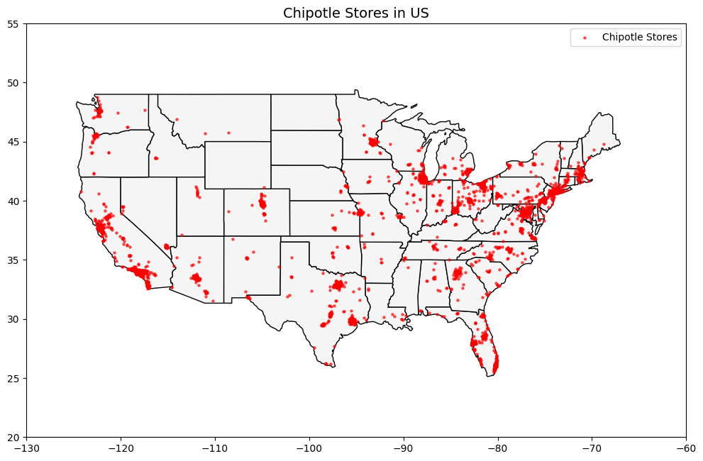

# 🥑 Chipotle Clustering Challenge 🚀

## 📌 Description
This project explores Chipotle restaurant locations across the USA to determine the **best place to live for a Chipotle superfan**. Using **unsupervised learning techniques**, we applied multiple clustering methods to group Chipotle locations and identify high-density areas. 

After testing **K-Means, DBSCAN, and HDBSCAN**, we found that **HDBSCAN provided the most meaningful clusters**. The analysis identified **Los Angeles, CA**, as the best place for the couple to live, with the highest Chipotle density. 

---
## ⚙️ Installation
To run this project, you need Python and the following dependencies:

Install the required libraries: `pip install pandas geopandas matplotlib seaborn folium scikit-learn hdbscan`

Clone the repository and navigate to the project directory: 
`git clone https://github.com/your-repo/chipotle-clustering.git && cd chipotle-clustering`

The project is structured into **two Jupyter notebooks**:
- `data_exploration.ipynb` → Used for **EDA (Exploratory Data Analysis)**.
- `data_clustering.ipynb` → Used for **experimenting with different clustering methods**.

---
## 🚀 Usage
- Check the **visuals folder** for multiple **interactive maps**.
- The final result is in **best_chipotle_hotspot.html**.

---
## 📊 Visuals
- ****

Interactive visualizations available in the repository in Visuals folder!

---
## 👤 Contributors
- **Solo Project** by Nicole Pretorius

---
## 🎯 Personal Situation
I am pivoting into **data analytics** and used this project to **practice clustering techniques**. The goal was to deepen my understanding of **geospatial data analysis** and clustering methodologies while working on a fun, real-world dataset.

---
## 📜 Report: Methods & Results
### **🔍 Clustering Methods Tested**
1. **K-Means**
   - Forced all locations into clusters.
   - Less effective due to **rigid, equal-sized clusters**.
2. **DBSCAN**
   - Identified **10 clusters**, the same as K-Means.
   - Did not significantly improve clustering results.
   - Some clusters were too fragmented.
3. **HDBSCAN (Best Choice)**
   - Identified **40 clusters** and a significant number of **outliers**.
   - More effectively pinpointed **high-density Chipotle areas**.
   - The ability to classify **outliers** helped to narrow down a more precise recommendation.

### **🏆 Final Recommendation: Los Angeles, CA**
- The **HDBSCAN algorithm identified the highest Chipotle density** in **Los Angeles, CA**.
- The best Chipotle location: 📍 **8888 Whittier Blvd, Pico Rivera, CA 90660**.
- This region offers **the best access** to Chipotle stores for a dedicated fan.

**Conclusion:** If the couple wants to enjoy **the most convenient Chipotle lifestyle**, moving to **Los Angeles** is the way to go! 🌮🔥

---
